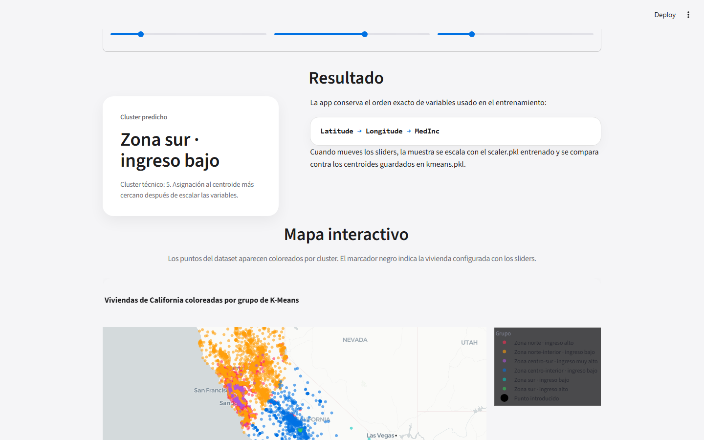

# Clusters de viviendas en California — App Streamlit

Aplicación web hecha con Streamlit que consume un modelo de K-Means entrenado sobre el dataset California Housing y predice el cluster al que pertenece una vivienda a partir de tres variables:

- `Latitude`
- `Longitude`
- `MedInc`

La app también muestra los registros del dataset sobre un mapa interactivo de Plotly, coloreados por grupo de K-Means, y resalta la vivienda configurada con los sliders.



## Limitación importante

Este proyecto **no predice precios de viviendas**.

El resultado es un cluster artificial generado por K-Means. No representa un barrio real, una categoría oficial ni una estimación de precio. El aviso se muestra dentro de la app para que quede explícito al usuario.

## Enlace al despliegue

La app está desplegada en Render:

```text
https://streamlit-kmeans-app-4geeks-project.onrender.com/
```

Fecha del último despliegue verificado: 2026-06-05.

El servicio corre en el plan gratuito de Render, que pone la app en reposo tras periodos de inactividad. La primera carga después de un reposo puede tardar alrededor de un minuto en despertar.

El despliegue se realizó como parte de la entrega de este proyecto. Es posible que el servicio deje de estar disponible en el futuro cuando el autor desactive la cuenta gratuita de Render o el servicio quede fuera de servicio. En ese caso, la app puede ejecutarse localmente con las instrucciones de la sección `Uso local`.

## Uso local

Instalar dependencias desde la raíz del repositorio:

```bash
pip install -r requirements.txt
```

Ejecutar la app:

```bash
streamlit run src/app.py
```

Versión de Python usada (también fijada en `runtime.txt` para Render):

```text
python-3.11.9
```

## Cumplimiento del enunciado

Referencia: `theory/enunciado.md`.

### Paso 1 — Modelo

Se reutiliza el modelo de K-Means entrenado en el proyecto anterior sobre el dataset California Housing. Los artefactos entrenados están en `models/`:

- `models/scaler.pkl`: escalador entrenado sobre `Latitude`, `Longitude`, `MedInc`.
- `models/kmeans.pkl`: modelo K-Means con los centroides guardados.
- `models/supervised.pkl`: modelo supervisado adicional conservado del proyecto anterior, no usado por la app actual.

El notebook original del modelo está en `src/explore.ipynb`.

### Paso 2 — Aplicación web con Streamlit

`src/app.py` implementa la interfaz con Streamlit. La app:

1. Carga el dataset y los artefactos entrenados (`scaler.pkl`, `kmeans.pkl`) usando `@st.cache_resource` y `@st.cache_data` para evitar recargas en cada rerun.
2. Muestra un encabezado con el título y la descripción.
3. Muestra un aviso visible sobre la limitación del modelo.
4. Muestra métricas resumen: cantidad de registros visualizados, clusters del modelo y variables usadas.
5. Permite configurar la vivienda con tres sliders cuyas entradas usan los rangos reales del dataset: Latitud, Longitud, Ingreso medio.
6. Construye un `DataFrame` de una fila con el orden exacto de variables usado en el entrenamiento (`Latitude → Longitude → MedInc`).
7. Aplica `scaler.transform()` sobre la muestra y predice el cluster con `kmeans.predict()`.
8. Muestra el cluster predicho con una etiqueta interpretativa (`CLUSTER_LABELS`) y, debajo, el identificador técnico del cluster.
9. Muestra el mapa interactivo de Plotly con todos los puntos del dataset coloreados por grupo y un marcador negro para la vivienda configurada.

Estilo visual: estética tipo Apple, definida con CSS propio y `DESIGN.md` como referencia externa (no se commitea al repo; se mantiene fuera de él por preferencia del autor). Tema de Streamlit definido en `.streamlit/config.toml` para que widgets nativos como el slider usen el azul Apple desde origen.

Recursos externos utilizados:

- Streamlit: https://docs.streamlit.io/
- Plotly Express (`px.scatter_map`): https://plotly.com/python/scattermapbox/
- Scikit-learn (KMeans, StandardScaler): https://scikit-learn.org/
- `getdesign` para la referencia visual Apple: https://getdesign.md/

### Paso 3 — Despliegue en Render

Configuración usada en Render:

```text
Root directory: raíz del repositorio
Build command: pip install -r requirements.txt
Start command: streamlit run src/app.py
Runtime:    python-3.11.9 (definido en runtime.txt)
```

Una vez desplegado, se abrió la URL pública para verificar que la app carga correctamente. En el plan gratuito de Render, el servicio puede tardar alrededor de un minuto en despertarse después de un periodo de inactividad.

## Estructura del proyecto

```text
src/app.py               Aplicación de Streamlit
src/explore.ipynb        Notebook original de K-Means y procedencia del modelo
data/raw/housing.csv     Datos de California Housing usados para el mapa
models/scaler.pkl        Escalador entrenado
models/kmeans.pkl        Modelo K-Means entrenado
models/supervised.pkl    Modelo supervisado adicional del proyecto anterior
docs/img/                Captura de la app para el README
.streamlit/config.toml   Tema de Streamlit (azul Apple, fondo claro)
requirements.txt         Dependencias de ejecución
runtime.txt              Versión de Python usada por Render
```

## Notas para la entrega

- El directorio `theory/` contiene material local de clase y **no forma parte de la entrega final** de 4Geeks.
- El archivo `DESIGN.md` con la referencia de diseño Apple se mantiene fuera del repositorio por preferencia del autor; la fuente de tokens aplicada en la app está en `.streamlit/config.toml` y en el CSS propio dentro de `src/app.py`.
